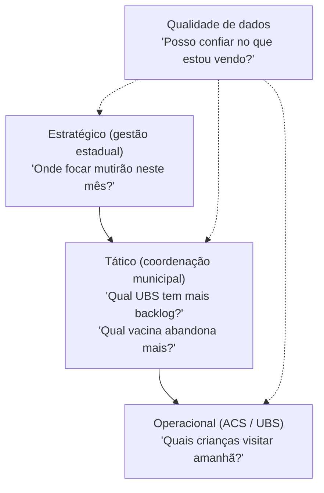
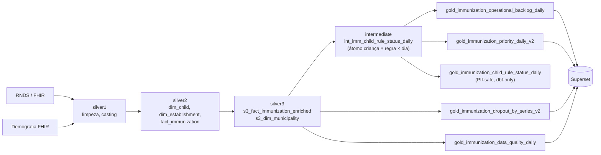
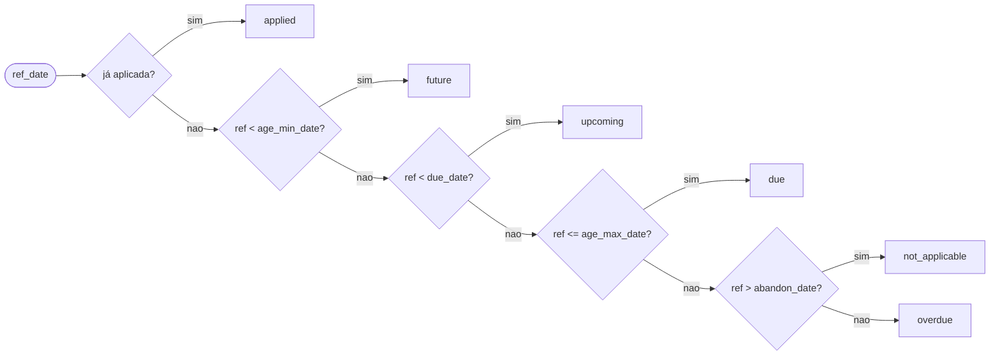

<!--
Licensed to the Apache Software Foundation (ASF) under one
or more contributor license agreements.  See the NOTICE file
distributed with this work for additional information
regarding copyright ownership.  The ASF licenses this file
to you under the Apache License, Version 2.0 (the
"License"); you may not use this file except in compliance
with the License.  You may obtain a copy of the License at

  http://www.apache.org/licenses/LICENSE-2.0
-->

# Gestão de Imunização — Documentação do Dashboard

Documento de referência para apresentar ao time. Cobre o problema de negócio,
o pipeline de dados (do RNDS até o Superset), cada gold mart, cada gráfico e
como interpretar os números.

---

## 1. Por que este dashboard existe

Hoje a equipe operacional de imunização precisa responder, todo dia, três
perguntas:

1. **Quem está em atraso, onde, e em que vacina?** — busca ativa precisa de
   prioridade clara, não de planilhas com 200 mil linhas.
2. **Onde vai ser a próxima crise?** — quantas crianças vencem nos próximos 30
   dias por município/UBS, para preparar capacidade.
3. **Os dados do RNDS estão confiáveis?** — se o registro está atrasado ou tem
   inconsistência, qualquer decisão clínica em cima fica enviesada.

O dashboard responde isso traduzindo o calendário nacional (PNI) + os
registros RNDS em **status por criança×regra**, e agregando em
indicadores acionáveis no nível município / UBS / vacina.

### Pirâmide de decisão



O dashboard responde os três níveis verticais; o nível operacional individual
("quais crianças visitar") sai do gold `gold_immunization_child_rule_status_daily`
(hasheado, restrito por RBAC — **não exposto no Superset**) e alimenta
sistemas externos (Django ChildImmunization).

---

## 2. Três versões do dashboard

| Tier | Slug | Público | Filtro padrão |
|------|------|---------|---------------|
| **Nacional (Interno)** | `gestao-imunizacao-operacional-v2` | PTM — todos os estados | Município=Porto (piloto) |
| **Estadual** | `gestao-imunizacao-estado-{uf}` | Cliente estadual | Estado pré-selecionado |
| **Municipal** | `gestao-imunizacao-municipio-{ibge}` | Cliente municipal | Estado + Município pré-selecionados |

Todas as três compartilham os mesmos **datasets** e **gráficos** — o que muda
é o layout (sem gráficos nacionais nas versões cliente) e o filtro padrão.
Veja [`README.md`](README.md) para os comandos de provisionamento.

---

## 3. Pipeline de dados (visão macro)



Camadas:

- **Bronze** (`models/bronze/`) — extratos crus do RNDS via Elasticsearch e da
  API FHIR de demografia. Sem transformação.
- **Silver 1** (`models/silver1/`) — limpeza por fonte: casts, trim de CPF/CNS,
  filtros de município ativos (`municipality_filter_where` macro lê
  `governance.municipality_activation`).
- **Silver 2** (`models/silver/2.intermediate/` + `silver2/`) — dimensões
  conformadas (`s2_dim_child`, `s2_dim_establishment`) e fatos
  (`s2_fact_immunization`).
- **Silver 3** (`models/silver3/`) — enriquecimento cross-source:
  - `s3_fact_immunization_enriched`: fato com CNES, estabelecimento, município
    de aplicação **e** de residência, bairro, CEP.
  - `s3_dim_municipality`: ponte canônica IBGE-6 → nome do município + estado.
  - `s3_vaccine_schedule`: calendário PNI (versão ativa + janelas etárias).
- **Intermediate** (`models/silver/2.intermediate/immunization/`) —
  `int_imm_child_rule_status_daily` é o **átomo operacional**.
- **Gold** (`models/gold/immunization/`) — marts prontos para consumo no
  Superset (ou em outros sistemas).

---

## 4. O átomo: `int_imm_child_rule_status_daily`

O modelo intermediário é a base de tudo. Vale entender bem.

### Grain
> Uma linha por **criança × vacina × dose × dia de referência**.

Se temos 50.000 crianças cadastradas em Porto e o calendário PNI tem ~80 doses
distintas (todas as vacinas × doses), tipicamente cada criança tem ~25 doses
relevantes pela faixa etária. O modelo gera ~50.000 × 25 = **~1,25 milhão de
linhas por dia** para o piloto.

### Cálculo do status

Para cada par (criança, regra do calendário), calcula a partir da data de
nascimento e da janela etária da regra:

| Marco | Cálculo | Significado |
|-------|---------|-------------|
| `age_min_date` | `birth_date + schedule_age_min_days` | A partir de quando a dose pode ser aplicada |
| `due_date` | `birth_date + schedule_preferred_age_days` | Idade ideal (ex.: BCG = ao nascer; DTP-1 = 60 dias) |
| `age_max_date` | `birth_date + schedule_age_max_days` | Última data antes de virar atraso |
| `abandon_date` | `birth_date + schedule_abandon_after_days` | Depois disso a dose não é mais aplicável |

E define **`status_bucket`** comparando `ref_date` (hoje) com esses marcos:



| status_bucket | O que significa em campo |
|---------------|--------------------------|
| `applied` | Dose já registrada no RNDS para essa criança |
| `future` | Criança ainda não atingiu a idade mínima — ignorar |
| `upcoming` | Criança já podia tomar, mas ainda não passou da idade ideal — incluir em comunicação preventiva |
| `due` | Está na janela ideal — convocação imediata |
| `overdue` | Passou da `age_max_date` — busca ativa prioritária |
| `not_applicable` | Passou tanto que a regra desconsidera (ex.: tomar BCG aos 12 anos) |

### Severidade do atraso (`overdue_bucket`)

Para os `overdue`, classificamos por gravidade:

| `overdue_bucket` | Faixa (dias após `age_max_date`) | Ação típica |
|------------------|----------------------------------|-------------|
| `not_overdue`   | n/a (não está em atraso)        | nenhuma |
| `1-7`           | até 1 semana                    | lembrete ativo |
| `8-30`          | 1 a 4 semanas                   | busca ativa local |
| `31-90`         | 1 a 3 meses                     | busca ativa intensiva |
| `91+`           | mais de 3 meses                 | avaliação clínica + risco crítico |

### Pegadinha de dedup

O `s3_vaccine_schedule` tem `age_bands` que **se sobrepõem** (ex.: `<2y` e
`0-11m`). Sem dedup, uma criança de 8 meses seria pareada com dois bands,
duplicando o registro. Resolvido com `QUALIFY ROW_NUMBER()`:

```sql
QUALIFY ROW_NUMBER() OVER (
    PARTITION BY ch.patient_address_key
    ORDER BY bands.min_days DESC, bands.max_days ASC
) = 1
```

Lê: para cada criança, escolho **o band mais específico** (maior `min_days`,
menor `max_days`). Garante 1 linha por (criança, regra).

### PII

Este modelo contém `patient_address_key` (hash composto) + `birth_date` +
`municipality_code`. **Não é exposto no Superset.** A versão hashada
(`gold_immunization_child_rule_status_daily`) usa SHA256 da
`patient_address_key` para auditoria sem reidentificação trivial.

---

## 5. Gold marts — explicação detalhada

### 5.1 `gold_immunization_operational_backlog_daily`

**Grain**: `ref_date × estado × município × UBS × vacina × dose × faixa_etária × status × overdue_bucket`

Agrega o átomo `int_imm_child_rule_status_daily` removendo PII. É o **dataset
central** do dashboard — alimenta KPIs, backlog por vacina, por UBS, por
município, e a heatmap de cobertura.

Colunas-chave:

| Coluna | Como é calculada |
|--------|------------------|
| `child_rule_pairs` | `COUNT(*)` — total de pares criança×regra na célula (= denominador para cobertura) |
| `overdue_count` | `COUNTIF(status_bucket = 'overdue')` |
| `due_count` | `COUNTIF(status_bucket = 'due')` |
| `upcoming_count` | `COUNTIF(status_bucket = 'upcoming')` |
| `applied_count` | `COUNTIF(status_bucket = 'applied')` |
| `not_applicable_count` | `COUNTIF(status_bucket = 'not_applicable')` |
| `future_count` | `COUNTIF(status_bucket = 'future')` |
| `total_days_overdue` | `SUM(days_overdue)` — soma de dias parados (útil para `severidade média = SUM/COUNT`) |
| `max_days_overdue` | `MAX(days_overdue)` — pior caso da célula |
| `overdue_share` | `SAFE_DIVIDE(overdue, overdue+due+upcoming+applied)` — proporção de atrasados sobre o universo elegível |

> **Atenção** — `overdue_share` exclui `future` e `not_applicable` do
> denominador. Isso é proposital: criança fora da janela não deve contar como
> "elegível".

**Problema que resolve**: dá um pano de fundo agregado por qualquer corte
(município, UBS, vacina, dose, faixa etária) sem precisar bater no modelo de
átomo (custo BigQuery menor + zero PII).

### 5.2 `gold_immunization_priority_daily_v2`

**Grain**: `ref_date × município`

Calcula um **score de prioridade operacional** por município (0-1, normalizado
min-max por dia). Substitui a v1 que só ranqueava por volume.

#### Fórmula

```
priority_score = 0.35 * overdue_share_norm     -- % atraso (peso maior)
               + 0.25 * overdue_total_norm     -- volume absoluto
               + 0.15 * trend_7d_norm          -- está piorando?
               + 0.10 * due_next_30_norm       -- pico de demanda iminente
               + 0.10 * low_registry_gap_norm  -- registro defasado (TODO)
               + 0.05 * dq_penalty_norm        -- qualidade ruim penaliza
```

Cada componente é normalizado por **min-max** dentro do mesmo `ref_date`
(`SAFE_DIVIDE(value - min, max - min)`), então o score é uma comparação
**relativa entre municípios**, não absoluta.

Os componentes:

| Componente | Fonte | Cálculo |
|-----------|-------|---------|
| `overdue_share` | backlog | `SUM(overdue) / SUM(child_rule_pairs)` por município |
| `overdue_total` | backlog | `SUM(overdue_count)` por município |
| `overdue_trend_7d` | backlog hoje vs há 7 dias | `(today - 7d_ago) / 7d_ago` |
| `due_count` | backlog | `SUM(due_count)` (pico de demanda atual) |
| `dq_share` | suspicious records | `SUM(issues_90d) / SUM(child_rule_pairs)` |
| `low_registry_gap` | TODO | placeholder=0 (precisa de população esperada do CENSO/IBGE) |

#### Classificação

A partir do `priority_score` derivamos categorias em PT-BR:

| Score | `priority_category` |
|-------|---------------------|
| ≥ 0.75 | crítica |
| ≥ 0.50 | alta |
| ≥ 0.25 | média |
| < 0.25 | baixa |

E uma `recommended_action` por regras de negócio:

- `overdue_share >= 0.4 AND trend_7d > 0.1` → "Acionar busca ativa urgente — doses em atraso crescendo"
- `overdue_share >= 0.4` → "Intensificar busca ativa — alto percentual de doses em atraso"
- `overdue_share >= 0.2 AND due_count > 50` → "Agendar mutirão de vacinação — pico de demanda previsto"
- `overdue_share >= 0.2` → "Monitorar e intensificar comunicação ativa com famílias"
- `due_count > 50` → "Preparar capacidade — muitas crianças com doses a vencer em breve"
- caso contrário → "Manter rotina — situação sob controle"

**Problema que resolve**: o gestor recebe "qual município atacar primeiro?" e
"o que fazer lá?" sem ler 6 colunas e fazer cálculo de cabeça.

> **Importante** — como é normalizado min-max, em dashboards de **um único
> município** todos os componentes normalizam para 0 (não há referência) e o
> score perde sentido. Por isso o `chart.v2.06_priority_ranking` (tabela
> baseada nesse mart) **só aparece no internal e estadual**, nunca no
> municipal.

### 5.3 `gold_immunization_dropout_by_series_v2`

**Grain**: `cohort_birth_year × município × vacina × (dose_from, dose_to)`

Mede **abandono** entre duas doses consecutivas da mesma vacina. Ex.: BCG só
tem 1 dose, mas DTP tem 1ª, 2ª, 3ª, reforço — o abandono é "% de quem tomou a
1ª e nunca tomou a 2ª".

Cálculo:

```sql
applied_from_count = COUNT(distinct crianças que tomaram dose_from)
applied_to_count   = COUNT(distinct crianças que tomaram dose_to E dose_from)
dropout_rate       = 1 - (applied_to / applied_from)
```

A v2 adicionou três salvaguardas:

| Campo | Por quê |
|-------|---------|
| `dropout_gap` | dias médios entre `dose_from` e `dose_to` aplicadas — se gap > esperado, registro pode estar atrasado, não abandono real |
| `denominator_warning` | `true` se `applied_from_count < 30` — taxa não é estatisticamente confiável |
| `effective_dropout_rate` | `NULL` quando `denominator_warning=true`; usar este nos gráficos para não exibir 100% baseado em 2 crianças |
| `priority_rank` | `RANK() OVER (vacina, dose_from ORDER BY effective_dropout_rate DESC NULLS LAST)` |

**Problema que resolve**: foca a atenção em séries com volume + abandono
significativo, evita "alarme falso" de coortes minúsculas.

### 5.4 `gold_immunization_data_quality_daily`

**Grain**: `município × vacina × dose × reason_code × reference_month`

Une duas fontes:

1. **Registros suspeitos** (`gold_immunization_suspicious_records`) —
   categorizados por `reason_code`:

   | `reason_code` | `reason_label` (PT-BR) | `severity` |
   |---------------|------------------------|------------|
   | `age_before_min` | "Dose aplicada antes da idade mínima" | warning |
   | `future_occurrence_date` | "Data de ocorrência no futuro" | critical |
   | `missing_vaccine_code` | "Código de vacina ausente" | warning |
   | `duplicate_dose_same_day` | "Dose duplicada no mesmo dia" | warning |

2. **Freshness** (`gold_immunization_data_freshness`) — quantas horas desde a
   última ingestão do RNDS, derivando um `freshness_status`:

   | `freshness_status` | Critério |
   |--------------------|----------|
   | `fresh` | última ingestão ≤ 24h |
   | `warning` | ≤ 72h |
   | `stale` | ≤ 168h (1 semana) |
   | `critical` | > 168h |

**Problema que resolve**: garante que a equipe não tome decisão em cima de
dado podre, e mostra exatamente **qual tipo de problema** está afetando qual
vacina.

### 5.5 `gold_immunization_child_rule_status_daily`

Pass-through **PII-safe** do átomo, com `patient_address_key` substituído por
`SHA256()`. **Não exposto no Superset**. Existe para auditoria via dbt + uso
em sistemas downstream com RBAC apropriado (ex.: Django ChildImmunization para
geração de listas de busca ativa).

---

## 6. Gráficos — o que mostram e como calculam

### 6.1 KPIs executivos (Linha 1)

Todos usam `dataset.operational_backlog_daily_v2` (exceto KPI freshness e
inconsistências, que tem datasets próprios).

#### `chart.v2.01_kpi_overdue` — Doses em atraso (hoje)
- **Cálculo**: `SUM(overdue_count)` (`overdue_count_v2` métrica registrada)
- **Filtro temporal**: `LAST DAY`
- **Decisão**: tamanho do problema agora. Se cresceu vs ontem (você verá no
  trend chart), busca ativa.

#### `chart.v2.02_kpi_due_next_30` — A vencer nos próximos 30 dias
- **Cálculo**: `SUM(due_count) + SUM(upcoming_count)` (atualmente apenas
  `due_count_v2`; ajustar se quiser incluir upcoming)
- **Decisão**: planejamento de capacidade — quanto vacinador/dose vou precisar.

#### `chart.v2.03_kpi_applied` — Doses aplicadas
- **Cálculo**: `SUM(applied_count)` no recorte filtrado.
- **Decisão**: contra-prova ao "em atraso" — entender o total atendido.

#### `chart.v2.04_kpi_freshness` — Dados atualizados há (min)
- **Fonte**: `dataset.data_freshness`
- **Métrica**: `TIMESTAMP_DIFF(CURRENT_TIMESTAMP(), MAX(s3_enriched_max_ingestion_ts), MINUTE)`
- **Decisão**: se > 60 min, alerta — ingestão RNDS pode ter quebrado.

#### `chart.v2.05_kpi_dq_issues` — Inconsistências (90d)
- **Fonte**: `dataset.data_quality_daily_v2`
- **Métrica**: `SUM(issue_count)` filtrado `reference_month >= last 90 days`
- **Decisão**: vale puxar o gráfico 15 (Inconsistências por tipo) e o 16
  (Inconsistências por vacina × dose) para entender.

#### `chart.v2.18_unknown_municipality` — Município desconhecido (**internal only**)
- **Métrica**: `SUM(child_rule_pairs)` onde `municipality_code = 'UNKNOWN'`
- **Decisão interna**: indica quantas crianças não têm IBGE de residência
  resolvido. Aciona o time de dados para investigar pipeline de demografia.

### 6.2 Visão operacional

#### `chart.v2.06_priority_ranking` — Ranking de prioridade por município
- **Fonte**: `dataset.priority_daily_v2`
- **Colunas**: `municipality_name`, `priority_category`, `recommended_action`,
  `priority_score`, `overdue_total`, `overdue_share`
- **Ordenação**: pelo `priority_score` desc.
- **Decisão**: ataque do topo. A coluna `recommended_action` já sugere o "o
  quê fazer".
- **Por que não aparece em municipal**: tem 1 só município = score trivial.

#### `chart.v2.07_backlog_vaccine` — Backlog por vacina × dose
- **Tipo**: barras horizontais agrupadas (`ptm_echarts_timeseries` modo bar)
- **Eixo X**: `vaccine_name`
- **Grupo**: `dose_label` (1ª, 2ª, reforço)
- **Métrica**: `SUM(overdue_count)`
- **Decisão**: onde está concentrado o atraso por imunobiológico.

#### `chart.v2.10_backlog_establishment` — Backlog por unidade de saúde
- **Eixo X**: `establishment_name`
- **Métrica**: `SUM(overdue_count)`
- **Decisão**: qual UBS pesa mais no município, para coordenação local.

#### `chart.v2.11_upcoming_workload` — Carga de trabalho prevista
- **Eixo X**: `vaccine_name`
- **Duas séries**: `SUM(upcoming_count)` (A vencer) + `SUM(due_count)` (Devidas hoje)
- **Decisão**: quanto vai bater de demanda nas próximas semanas, por vacina.

#### `chart.v2.12_overdue_bucket_dist` — Distribuição de atraso por severidade
- **Eixo X**: `vaccine_name`
- **Grupo**: `overdue_bucket` (1-7, 8-30, 31-90, 91+)
- **Métrica**: `SUM(overdue_count)`
- **Decisão**: prioriza vacinas onde a maior parte do atraso é antiga (91+ =
  risco crítico).

### 6.3 Cobertura

#### `chart.v2.09_coverage_heatmap` — Cobertura por vacina × dose
- **Tipo**: `ptm_pivot_table`
- **Linhas**: `vaccine_name`, **colunas**: `dose_label`
- **Métrica**: `SAFE_DIVIDE(SUM(applied_count), NULLIF(SUM(child_rule_pairs), 0))`
- **Por que essa fórmula?** Cobertura = aplicadas / elegíveis (incluindo
  atrasadas que ainda podem tomar). NÃO usamos `AVG(overdue_share)` porque
  isso seria média de proporções (matematicamente errado, não é ponderado).
- **Decisão**: cobertura por imunobiológico × posição da dose. Vacina com 1ª
  dose alta e 3ª baixa indica abandono.

#### `chart.v2.20_state_coverage_matrix` — Matriz de cobertura Estado × Vacina (**internal only**)
- Mesma fórmula da 9, pivotada em `state_name × vaccine_name`.
- **Decisão estratégica**: comparação inter-estadual. Por isso só faz sentido
  no internal.

### 6.4 Tendências

#### `chart.v2.08_timeliness_trend` — Doses no prazo vs atrasadas
- **Tipo**: `ptm_mixed_timeseries` (barras + linha)
- **Fonte**: `dataset.timeliness_monthly`
- **Série A (barras)**: `SUM(on_time_count)` — aplicações no prazo
- **Série B (linha)**: `SUM(late_count)` — aplicações atrasadas
- **Decisão**: pulso temporal — está melhorando ou piorando ao longo dos meses.

### 6.5 Abandono

#### `chart.v2.13_dropout_ranking` — Ranking de abandono por série vacinal
- **Tipo**: `ptm_table`
- **Colunas**: `vaccine_name`, `dose_from_label`, `dose_to_label`,
  `cohort_birth_year`, `AVG(effective_dropout_rate)`, `applied_from_count`,
  `applied_to_count`, `MIN(priority_rank)`
- **Filtro implícito**: `effective_dropout_rate IS NOT NULL` (graças à
  salvaguarda do denominador no mart).
- **Decisão**: foca as séries que mais perdem entre doses sucessivas.

#### `chart.v2.14_dropout_bar` — Taxa de abandono por vacina (horizontal)
- **Eixo X**: `vaccine_name`
- **Grupo**: `dose_from_label`
- **Métrica**: `AVG(effective_dropout_rate)`, formato `%`
- **Decisão**: comparação visual rápida — qual vacina abandona mais.

### 6.6 Qualidade dos dados

#### `chart.v2.15_suspicious_by_reason` — Inconsistências por tipo de problema
- **Tipo**: barra temporal
- **Eixo X**: `reference_month` (mês)
- **Grupo**: `reason_label` (PT-BR)
- **Métrica**: `SUM(issue_count)`
- **Decisão**: que tipo de problema cresceu e em que mês. Ex.: pico de
  `Dose duplicada no mesmo dia` em março ⇒ investigar UBS que mandou duplicado.

#### `chart.v2.16_suspicious_by_vaccine` — Inconsistências por vacina × dose
- **Tipo**: tabela
- **Colunas**: `vaccine_code`, `dose_sequence`, `reason_label`, `severity`,
  `freshness_status`, `SUM(issue_count)`
- **Decisão**: cruzamento detalhado — qual combinação vacina+dose tem o
  problema, com severidade e contexto de freshness.

### 6.7 Visão estadual (apenas internal)

#### `chart.v2.19_state_priority_table` — Prioridade por município — visão estadual
- Igual ao 06, mas com `state_name` na grouping para mostrar em qual estado
  está cada município.
- Só aparece no internal porque numa view estadual já está filtrado pelo
  estado (redundante) e numa municipal seria 1 linha (inútil).

---

## 7. Filtros nativos — como propagam

Os filtros (`Estado`, `Município`, `Vacina`, `Dose`, `UBS`, `Faixa etária`,
`Status`, `Gravidade do atraso`, `Período`) são **single-target**, ancorados
no `dataset.operational_backlog_daily_v2`.

### Mecanismo de propagação

O Superset usa o **nome da coluna** do filtro para gerar o `WHERE` em **todos
os gráficos do dashboard cujos datasets têm uma coluna com o mesmo nome**.
Não há JOIN — é matching textual de coluna.

Exemplo: filtro `Estado = 'Piauí'` (coluna `state_name`):
- ✓ `operational_backlog_daily_v2.state_name` → propaga
- ✓ `priority_daily_v2.state_name` → propaga
- ✗ `data_quality_daily_v2.municipality_state_name` → **não propaga** (nome
  diferente)
- ✗ `dropout_by_series_v2.municipality_state_name` → **não propaga**

Mapa de propagação dos filtros principais:

| Filtro | Coluna | Propaga para |
|--------|--------|--------------|
| Estado | `state_name` | backlog, priority |
| Município | `municipality_name` | backlog, priority, dropout, dq, timeliness |
| Vacina | `vaccine_name` | backlog, priority, dropout |
| Dose | `dose_label` | backlog |
| UBS | `establishment_name` | backlog |
| Status | `status_bucket` | backlog |
| Gravidade | `overdue_bucket` | backlog |
| Período | (temporal) | charts com adhoc_filter em coluna de data |

> **Pendência conhecida** — alguns datasets v2 herdaram nomes
> `municipality_state_name` da v1. Para o filtro Estado funcionar em DQ /
> dropout / timeliness, precisamos uniformizar para `state_name` numa rodada
> de dbt futura.

---

## 8. Cadência de atualização

- **Refresh do dashboard no Superset**: 300s (5 min) — `refresh_frequency` em
  `json_metadata`.
- **Atualização do BigQuery (dbt)**: depende do Airflow.
  - `s3_fact_immunization_enriched`: incremental por data de ingestão (~1×/h)
  - `int_imm_child_rule_status_daily`: incremental por `ref_date = today` (1×/dia)
  - Gold marts: derivam direto do átomo + S3 (1×/dia)
- **Janela ideal de checagem**: KPI freshness mostra o tempo da última
  ingestão. Se passar de 60 min, suspeitar de quebra no pipeline.

---

## 9. Limitações conhecidas (TODO)

| Item | Impacto | Mitigação atual |
|------|---------|-----------------|
| `team_id` / `microarea_code` ausentes do bronze RNDS | Não dá pra cortar por ACS/microárea | Colunas NULL com TODO no SQL |
| `low_registry_gap` no priority score | Componente vale 0 (peso 10%) | Score subestima municípios com cadastro defasado vs população real |
| Mapa choropleth | Não temos | TODO: usar `s2_dim_address_with_geolocation` quando estiver pronto, ou plugin choropleth PTM |
| Coluna `municipality_state_name` vs `state_name` | Filtro Estado não propaga em todos os datasets | Padronizar nome em rodada de dbt futura |
| RBAC por scope | Cliente municipal pode mudar o filtro pra ver outros municípios | Hoje "visible but defaulted"; row-level security é próxima iteração |

---

## 10. Glossário

| Termo | Significado |
|-------|-------------|
| **PNI** | Programa Nacional de Imunizações (calendário oficial) |
| **RNDS** | Rede Nacional de Dados em Saúde — fonte primária de aplicações |
| **CNES** | Cadastro Nacional de Estabelecimentos de Saúde — identificador da UBS |
| **IBGE** | Código IBGE-6 do município |
| **CNS** | Cartão Nacional de Saúde |
| **`patient_address_key`** | Hash composto interno (não é PII direta), mas tratamos como sensível |
| **Atom / Átomo** | `int_imm_child_rule_status_daily` — menor unidade de status |
| **Regra (de calendário)** | Uma combinação (vacina, dose, faixa etária, idade preferencial) do PNI |
| **`child × rule pair`** | Uma linha do átomo — uma criança contra uma regra do calendário |
| **Cobertura** | `aplicadas / elegíveis` (criança × regra) — não confundir com "% sem atraso" |
| **Abandono** | Tomou a dose N mas não a N+1 dentro da janela |
| **Backlog** | Conjunto de child×rule pairs com `status_bucket = overdue` ou `due` |
| **Freshness** | Tempo decorrido desde a última ingestão do RNDS |
| **Severity (DQ)** | `critical | warning | info` para registros suspeitos |
| **Score de prioridade** | Número 0-1 normalizado por dia, comparativo entre municípios |

---

## 11. Onde aprofundar

- Pipeline dbt: [`ptm-dw-modeling/models/silver3/immunization/`](https://github.com/PortalTelemedicina/ptm-dw-modeling/tree/development/models/silver3/immunization) e [`models/gold/immunization/`](https://github.com/PortalTelemedicina/ptm-dw-modeling/tree/development/models/gold/immunization)
- Calendário PNI versionado: [`models/silver3/clinical/s3_vaccine_schedule.sql`](https://github.com/PortalTelemedicina/ptm-dw-modeling/blob/development/models/silver3/clinical/s3_vaccine_schedule.sql)
- Registry de municípios ativos: tabela BigQuery `governance.municipality_activation`, espelhada do Django `activation_municipalityactivation` via Airflow
- Bootstrap dos dashboards: [`bootstrap_via_api.py`](bootstrap_via_api.py) — fonte da verdade para datasets, gráficos, filtros, layouts
- Operação local-first → dev → prod: ver seções "Workflow recomendado" e "Dashboard tiers" no [`README.md`](README.md)
