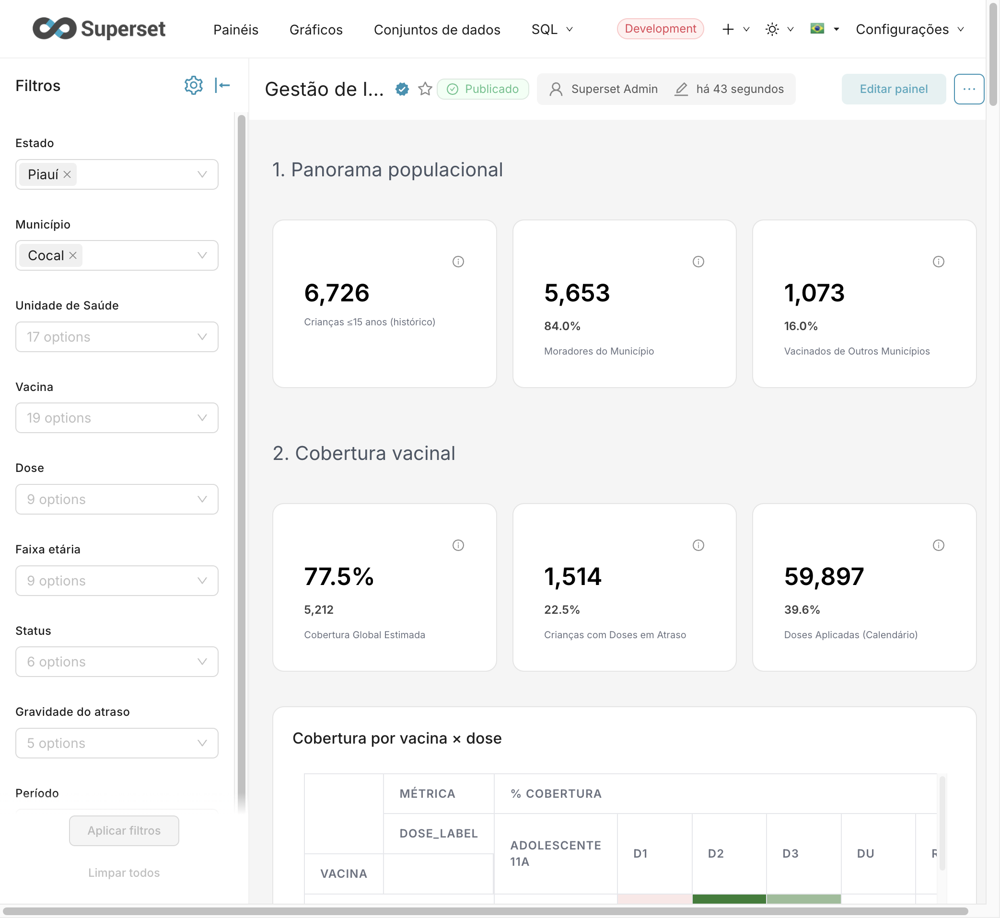
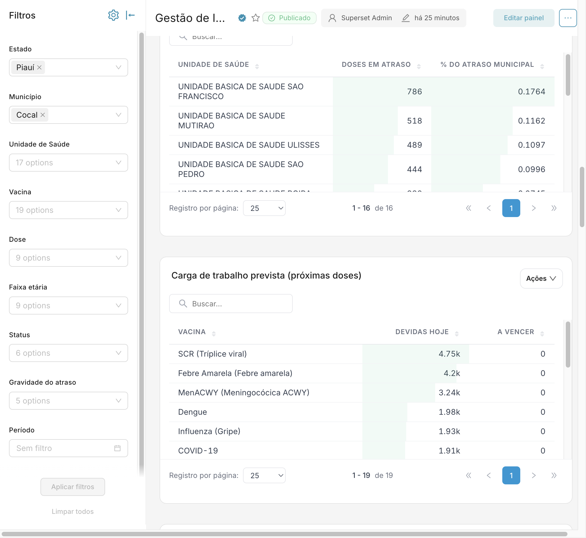
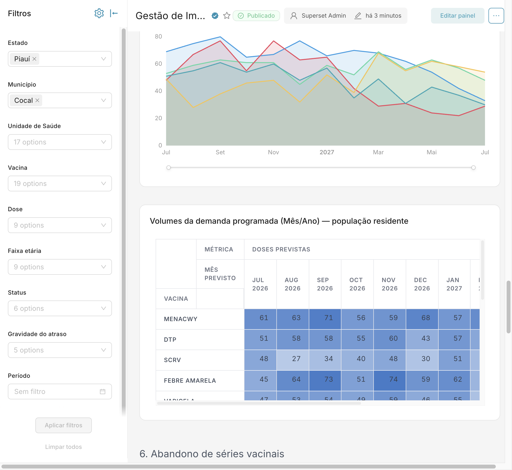
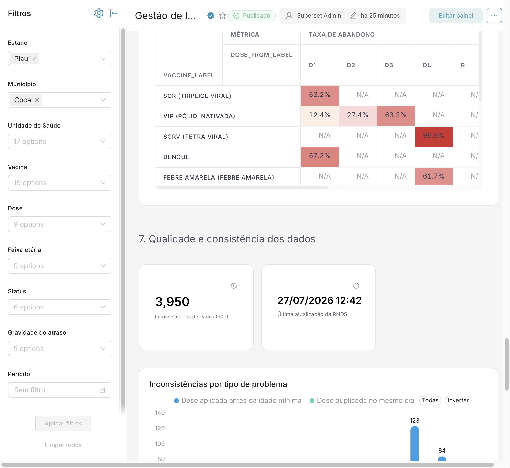
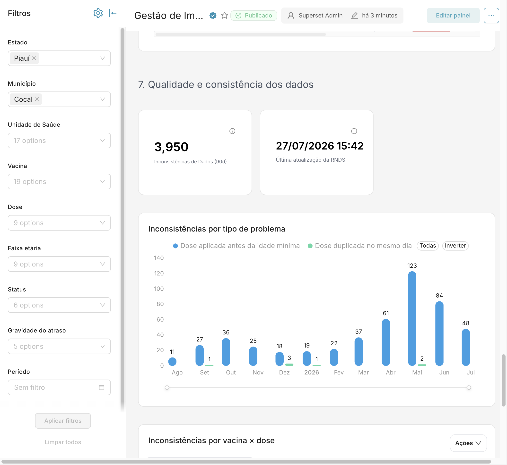

# Guia chart por chart — Gestão de Imunização (Cocal/PI)

Para cada gráfico: o que o número conta, **qual é o denominador do percentual** e
uma frase pronta. Números conferidos em 27/07/2026, com a carga da RNDS das 12:42.

---

## A regra que evita 90% da confusão

O painel tem percentuais com **três denominadores diferentes**, e eles não são
somáveis nem comparáveis entre si:

| Tipo de percentual | Denominador | Onde aparece |
|---|---|---|
| **Por criança** | total de crianças | cobertura, crianças em atraso, fluxo entre municípios |
| **Por obrigação de dose** | pares criança × regra do calendário | doses atrasadas, a vencer, aplicadas |
| **Por par de doses** | quem tomou a dose anterior | abandono |

"Obrigação de dose" é cada dose que o calendário exige de cada criança ao longo
da vida. Uma criança gera dezenas delas. Por isso um percentual por dose sempre
parece pequeno perto de um percentual por criança.

> **Nunca some percentuais de cards diferentes.** Além do denominador, o recorte
> da população muda: indicadores operacionais contam por **unidade que atende**,
> indicadores de cobertura contam por **município de residência**.

---

## Seção 1 — Panorama populacional

### Crianças ≤15 anos (histórico) — **6.726**
Crianças distintas com algum registro de vacinação nas unidades de Cocal. É o
universo de todo o restante da seção. Não tem percentual porque é o denominador
dos outros.

### Moradores do Município — **5.653 (84,0%)**
Crianças cuja residência é Cocal. O percentual é sobre as 6.726.

### Vacinados de Outros Municípios — **1.073 (16,0%)**
Crianças atendidas em Cocal que moram em outro lugar. Mesmo denominador.

> *"Cocal atende 6.726 crianças. Uma em cada seis não mora aqui — o município
> atende mais gente do que tem."*

---

## Seção 2 — Cobertura vacinal

### Cobertura Global Estimada — **77,5%**, com **5.212** abaixo
Atenção: neste card o percentual é o número grande e o absoluto é o pequeno,
invertido em relação aos demais. São 5.212 crianças **sem nenhuma dose vencida**,
sobre o total de crianças residentes.

### Crianças com Doses em Atraso — **1.514 (22,5%)**
Crianças com **ao menos uma** dose vencida. Basta uma para entrar aqui.

> Estes dois cards fecham entre si: **5.212 + 1.514 = 6.726**, e 77,5% + 22,5% =
> 100%. São o par mais seguro para conduzir a narrativa.

### Doses Aplicadas (Calendário) — **59.897 (39,6%)**
Doses efetivamente aplicadas. O percentual é sobre as obrigações de dose: 39,6%
de tudo que o calendário já exigiu foi cumprido. O resto se divide entre o que
ainda não venceu e o que está atrasado.

**Cuidado:** é cobertura *estimada*. O denominador são as crianças com registro no
sistema, não a projeção do IBGE — não vai bater com o painel do Ministério.

### Cobertura por vacina × dose (matriz)
Abre o 77,5% por vacina e por dose. Cor mais fria indica distância da meta.
Serve para mostrar que a lacuna raramente é a vacina inteira: costuma ser uma
dose específica, quase sempre reforço.

### Pontualidade — doses no prazo vs atrasadas
Duas séries mensais, "No prazo" e "Atrasadas", mais a linha de % atrasadas no eixo
secundário. Vermelho é sempre o atraso. O denominador do percentual são as doses
com correspondência no calendário.

---

## Seção 3 — Doses em atraso e carga operacional

### Total de Doses Atrasadas — **4.456 (2,5%)**
São **doses, não crianças**: uma criança pode ter várias. O percentual é sobre as
obrigações de dose, cerca de 178 mil em Cocal.

> *"São 4.456 doses atrasadas, concentradas em 1.514 crianças — cerca de três
> doses por criança em atraso. O problema não está espalhado, está concentrado."*

**Se perguntarem por que 2,5% ao lado de 22,5%:** *"o 2,5% é sobre o calendário
inteiro dessas crianças; o 22,5% é sobre as crianças. Uma criança com uma única
dose vencida já conta nos 22,5%, mas essa dose é um ponto dentro de dezenas de
obrigações."*

### Doses a Vencer (Até 30 dias) — **354**
Doses que vencem no próximo mês. É a agenda, não a dívida. Mesmo denominador do
card anterior.

### Doses em atraso por vacina e dose (matriz)
Distribui as 4.456 doses. Mostra que MenACWY, VIP, COVID-19, Hepatite A e Dengue
concentram o volume, e em quais doses.

### Doses em atraso por unidade de saúde — **16 unidades**
A coluna "% do Atraso Municipal" é a fatia de cada unidade nas 4.456 doses. São
Francisco tem **786 doses, 17,6%**, seguida de Mutirão com 518 e Ulisses com 489.

> *"Quatro unidades concentram quase metade da fila. Isso transforma um problema
> de 4,4 mil doses em quatro conversas objetivas com quatro gerentes."*

### Carga de trabalho prevista — por vacina
"Devidas Hoje" é o que já pode ser aplicado agora: SCR com 4,75 mil, Febre Amarela
com 4,2 mil, MenACWY com 3,24 mil. É a lista do que precisa estar na geladeira.

### Distribuição de Atrasos por Faixa de Dias
Separa o atraso por gravidade: 1-7 dias, 8-30, 31-90, 91+. Atraso recente se
resolve com convocação; atraso de mais de 90 dias exige busca ativa domiciliar.

---

## Seção 4 — Fluxo entre municípios

Os três cards decompõem exatamente os 1.073 de fora: **639 + 422 + 12 = 1.073**.

### Residentes Fora do Estado — **639 (9,5%)**
Crianças de outra UF. Em Cocal este é o maior grupo de fora.

### Atendimentos Regionais — **422 (6,3%)**
Crianças de outros municípios do Piauí.

### Erros de Correspondência — **12 (0,2%)**
Origem não mapeada. É indicador de qualidade de cadastro, não de fluxo real.

> *"Cocal recebe mais crianças de fora do estado do que de outros municípios do
> Piauí. Isso é insumo e equipe que o município banca para atender população que
> não é dele — é argumento direto de financiamento."*

As duas tabelas abaixo abrem esses números por UF e por município de origem.

---

## Seção 5 — Previsibilidade de doses

### Tendência da demanda programada
Projeta 12 meses para as **cinco vacinas de maior volume**, cada uma com sua cor:
MenACWY, DTP, Febre Amarela, SCRV e Varicela. Use o filtro Vacina para isolar uma.

**Cuidado:** mostra só demanda **programada**, ou seja, doses que vão vencer no
período. O acúmulo de atrasados ficaria todo no mês corrente e achataria a curva;
esse estoque está nos cards da seção 3.

### Volumes da demanda programada (Mês/Ano)
O número exato por vacina e por mês — é o que se leva para a planilha de compra.
MenACWY, por exemplo, fica entre 56 e 71 doses por mês no próximo semestre.

---

## Seção 6 — Abandono de séries vacinais

### Taxa de abandono por vacina (matriz)
Cada linha é uma vacina, cada coluna é a dose de origem. O percentual é: de quem
tomou aquela dose, quanto **não** tomou a seguinte. O denominador é o número de
crianças que tomaram a dose de origem — diferente de todos os outros gráficos.

Os casos confiáveis, com base grande: **Pentavalente D1 com 12,6%**, **VIP D1 com
12,4%** e **MenC D1 com 16,2%** (2.852 crianças).

`N/A` significa que aquele par de doses não existe no calendário, ou que a base é
menor que 30 crianças — não significa zero.

### A pergunta difícil: as células perto de 100%

VIP `R1` com 99,9%, SCRV `DU` com 99,9% e Influenza `DU` com 96,6%. **Levante você
o assunto antes que perguntem.**

Não é comportamento da população, é régua errada. Na VIP, 1.160 crianças tomaram a
dose de origem e **uma** tomou a seguinte — o que nenhuma poderia ter feito, porque
a dose seguinte só vence aos 4 anos e a coorte tem 1 ano. A Influenza é caso à
parte: é revacinação anual, e o modelo trata a dose do ano seguinte como
continuação de série.

> *"Vocês vão ver três células perto de 100%, e eu quero tratar isso de frente.
> Não é abandono, é a régua errada: o modelo cobra uma dose que só vence daqui a
> três anos. O caso que vocês apontaram na última reunião, o da meningocócica,
> esse já foi corrigido e hoje lê 16,2% sobre 2.852 crianças. Os três que sobraram
> estão auditados e especificados."*

**Se insistirem em prazo:** a correção exige cruzar a idade mínima da dose de
destino, que existe na tabela de calendário mas ainda não está no mart. É mudança
de modelo, não ajuste de tela.

---

## Seção 7 — Qualidade e consistência dos dados

### Inconsistências de Dados (90d) — **3.950**
Registros que violam alguma regra do calendário nos últimos 90 dias. Sem
percentual: é contagem absoluta de ocorrências.

### Última atualização da RNDS — **27/07/2026 12:42**
Horário de Brasília da última carga de dados. É o que garante que tudo na tela é
do dia.

### Inconsistências por tipo de problema
Em azul, dose aplicada antes da idade mínima, entre 11 e 123 casos por mês. Em
verde, dose duplicada no mesmo dia, entre 1 e 3 casos.

> *"A série verde é minúscula de propósito: duplicidade praticamente não existe
> aqui. O volume está todo em idade mínima, que é digitação ou regra de calendário
> na ponta — um problema tratável."*

### Inconsistências por vacina × dose
Duas colunas: total e críticas. "Críticas" filtra pela severidade alta, que é o
que exige correção imediata no prontuário.

### Inconsistências por unidade de saúde
Transforma o número agregado em lista de conversas com unidades específicas.

> *"Terminar pela qualidade do dado é proposital: o painel mostra os próprios
> defeitos, com nome e endereço."*
